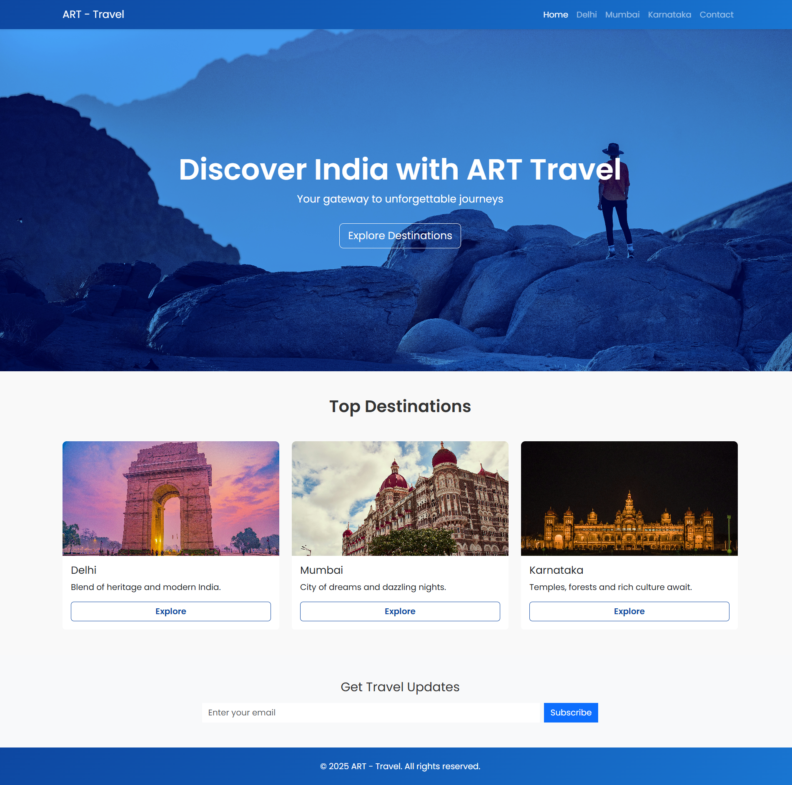

# ART - Travel 🌍✈️

A professional and responsive travel booking website built with modern HTML, CSS, and Bootstrap.  
Explore Indian destinations like Delhi, Mumbai, and Karnataka, and book your adventures seamlessly.

---

## 🚀 Features

- Modern & responsive UI
- Clean layout with consistent theme
- Dynamic booking cost calculator
- Destination-specific detail pages
- Interactive travel plans and image previews

---

## 🌐 Preview



---

## 📸 Technologies Used

- HTML5 & CSS3
- Bootstrap 5
- JavaScript (for booking calculator)
- Google Fonts
- Responsive Web Design

---

## 📁 Project Structure

```plaintext
ART-Travel/
├── index.html
├── delhi.html
├── mumbai.html
├── karnataka.html
├── booking.html
├── contact.html
├── css/
│   └── styles.css
├── img/
│   ├── delhi.jpg
│   ├── preview.jpg ← (This is the preview image)
│   └── ...
└── js/
    └── (optional)
